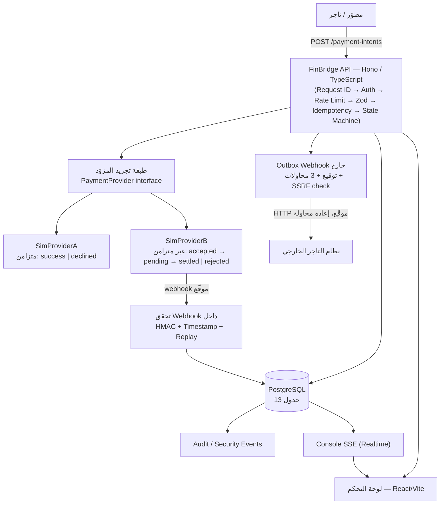

# FinBridge — الدليل الرسمي الشامل لفريق الهاكاثون (A–Z)

> **مصدر الحقيقة الوحيد** لكل من: مصمم العرض التقديمي، المتحدث الرسمي، مشغّل العرض الحي (Demo)، مطوري الواجهة الأمامية والخلفية، وأعضاء المنتج والأعمال.

**تنبيه منهجي مهم:** هذا الملف مبني بالكامل على فحص فعلي للكود المصدري والوثائق الموجودة في المستودع (`server/`, `web/`, `docs/`, `drizzle/`, ملفات الإعداد). لا يحتوي على أي ميزة أو رقم أو ادعاء لم يتم التحقق منه في الكود. كل ادعاء يحمل إحدى الحالات التالية:

| الرمز | المعنى |
|---|---|
| `IMPLEMENTED` | موجود ويعمل فعليًا في الكود، تم التحقق منه بقراءة الملفات مباشرة |
| `PARTIALLY IMPLEMENTED` | البنية موجودة جزئيًا لكن غير مكتملة أو غير مفعّلة بالكامل |
| `PROTOTYPE` | يعمل لغرض العرض التوضيحي فقط (Sandbox/Demo)، وليس سلوكًا للإنتاج |
| `PLANNED` | مذكور كفكرة مستقبلية في `docs/hackathon-pitch.md` فقط، غير موجود في الكود |
| `NOT VERIFIED` | لا يوجد دليل كافٍ في المستودع — يجب تأكيده يدويًا قبل عرضه على الحكام |

> ⚠️ **تنبيه جذري يجب قراءته أولًا:** هذا المشروع هو **منصّة اختبار تفاعلية للمدفوعات (Payment Interoperability Sandbox)** فقط. تم فحص كامل الكود الخلفي (`server/src`) والواجهة الأمامية (`web/src`) بحثًا عن أي منطق يخص **الدفع عند الاستلام (COD)، الشحن، شركات التوصيل، أو تتبع الطرود** — **ولم يُعثر على أي أثر لذلك إطلاقًا**. كل ما ورد في الكود تحت كلمة "delivery" يخص **تسليم Webhook عبر HTTP** فقط، وليس له علاقة بتوصيل بضائع فعلية. لذلك، أي قسم في هذا الدليل يتعلق بـ COD أو الشحن سيوضّح ذلك صراحة بدلاً من اختلاق ميزة غير موجودة — التزامًا بمبدأ الصدق المطلوب في هذه الوثيقة.

---

# 1. الهاكاثون ومحاذاة المشروع (Hackathon Challenge Alignment)

## 1.1 ما هو الهاكاثون؟

المعلومات التالية مأخوذة حرفيًا من `README.md` و `docs/hackathon-pitch.md` — وهي **الوصف الذي كتبه الفريق نفسه**، وليست نسخة من نشرة رسمية خارجية (لم يتم العثور على أي ملف PDF/rules/judging-criteria رسمي داخل المستودع).

| العنصر | القيمة |
|---|---|
| اسم الفعالية | **US-Libya Global Innovation Bridge Hackathon 2026** |
| المسار (Track) | **Entrepreneurship — Sandbox FinTech / APIs** |
| اسم المشروع | **FinBridge — Secure FinTech Interoperability Sandbox** |

> **`NOT VERIFIED — CONFIRM BEFORE PRESENTING TO JUDGES`**: لا توجد في المستودع نشرة تحدي رسمية (Challenge Brief)، ولا معايير تحكيم رسمية (Judging Rubric)، ولا قواعد مسابقة مكتوبة من الجهة المنظمة. كل ما ورد أعلاه هو وصف الفريق لفهمهم الخاص للمسار. **على الفريق الحصول على أي وثيقة رسمية من المنظمين ومراجعة القسم 1.4 و1.5 أدناه في ضوئها قبل العرض.**

## 1.2 ما هو التحدي الحقيقي؟

بناءً على وصف الفريق نفسه في `docs/hackathon-pitch.md`، التحدي الذي يعالجه المشروع هو:

> كل مزوّد مالي (بنك، محفظة إلكترونية، معالج بطاقات) يعرض API مختلفًا، ونموذج مصادقة مختلفًا، وصيغة Webhook مختلفة، ودورة حياة معاملة مختلفة. المطوّر الذي يريد التكامل مع مزوّدين يكتب تكاملين منفصلين، ويختبرهما بطريقتين مختلفتين، ولا يملك بيئة آمنة لتجربة أخطر سيناريوهات الفشل (Webhook مزوّر، حدث مكرر، دفعة مكررة) قبل الاقتراب من أموال حقيقية.

## 1.3 لماذا FinBridge مناسب لهذا التحدي؟

```
تحدي الهاكاثون (Sandbox FinTech / APIs)
        ↓
المشكلة: تجزّؤ تكامل مزودي الدفع + غياب بيئة آمنة لاختبار الأمان
        ↓
حل FinBridge: عقد API موحّد أمام مزودَين محاكاة مختلفَين جوهريًا
        ↓
القدرات المُنفّذة فعليًا: State Machine موحّدة، Webhooks موقّعة، Idempotency، Replay Protection، SSRF Protection، Audit Trail
        ↓
النتيجة القابلة للعرض حيًا: 7 خطوات Demo قابلة للتكرار بالكامل محليًا (`docs/demo.md`)، واختبار Smoke فعلي (15/15 ناجح) يضرب الـ API الحقيقي
```

## 1.4 خريطة المتطلبات (Requirement Mapping)

| متطلب الهاكاثون (المسار المعلن) | ماذا يعني؟ | كيف يعالجه FinBridge؟ | الدليل في المشروع | الحالة |
|---|---|---|---|---|
| Sandbox FinTech | بيئة مالية محاكاة، لا أموال حقيقية | `sandbox: true` على كل Payment Intent، لا اتصال ببنك/معالج حقيقي | `server/src/db/schema.ts` عمود `sandbox` افتراضي `true`؛ ذُكر في كل صفحة UI وفي `README.md` | `IMPLEMENTED` |
| APIs (تصميم وتوحيد واجهات) | واجهة برمجية نظيفة وموثقة | REST API واحد فوق مزوّدين مختلفين + توثيق OpenAPI 3.0 تفاعلي على `/docs` | `server/src/openapi.ts`, `server/src/app.ts` | `IMPLEMENTED` |
| Entrepreneurship (قابلية تحويله لمنتج) | هل للفكرة قيمة تجارية مستدامة؟ | نموذج "بنية تحتية للمطورين لاختبار التكاملات المالية" — راجع القسم 24 | `docs/hackathon-pitch.md` قسم "Business potential" | جزء منه `PLANNED` (أفكار مستقبلية)، الأساس التقني `IMPLEMENTED` |
| الأمان (ضمني في أي مشروع مالي) | حماية من التزوير، إعادة التشغيل، إساءة الاستخدام | مصادقة API Key مُجزّأة (scrypt)، توقيع HMAC للـ Webhooks، حماية Replay على مستوى قاعدة البيانات، حماية SSRF، Rate Limiting، Audit Trail | القسم 15 كاملًا أدناه | `IMPLEMENTED` |

## 1.5 خريطة معايير التحكيم (Judging Criteria Mapping)

> `NOT VERIFIED — CONFIRM BEFORE PRESENTING TO JUDGES`: لم يتم العثور على معايير تحكيم رسمية داخل المستودع. الجدول التالي يستخدم الأبعاد الشائعة في هاكاثونات ريادة الأعمال (ابتكار، تنفيذ تقني، تصميم/تجربة مستخدم، قيمة أعمال، جودة العرض) استنادًا إلى بنية `docs/hackathon-pitch.md` نفسها (التي تحتوي فعليًا على أقسام: Problem / Solution / Innovation / Demo / Security / Business potential) — **وليست نسخة عن معيار رسمي من المنظمين.**

| البُعد المفترض | ماذا يبحث عنه الحكام عادة؟ | كيف يعالجه FinBridge | الدليل | ماذا نعرض / نقول |
|---|---|---|---|---|
| الابتكار (Innovation) | فكرة تحل مشكلة حقيقية بطريقة غير بديهية | توحيد مزوّدين مختلفين جوهريًا (متزامن/غير متزامن) خلف عقد واحد، مع منطق التطبيع في مكان واحد فقط | `server/src/modules/providers/types.ts` (`ProviderResult.canonicalStatus`) | اعرض Step 1 و2 من `docs/demo.md` جنبًا إلى جنب |
| التنفيذ التقني (Technical Execution) | هل الكود يعمل فعلًا وليس عرضًا تقديميًا فقط؟ | آليات أمان تُثبت حيًا (تزوير Webhook يُرفض فعليًا، تكرار الطلب يُرفض فعليًا) وليست استجابات ثابتة | Steps 4–6 في `docs/demo.md`؛ `pnpm smoke-test` (15/15) | نفّذ `pnpm smoke-test` مباشرة أمام الحكام |
| قيمة الأعمال (Business Value) | هل يمكن أن يصبح منتجًا حقيقيًا؟ | بنية تحتية للمطورين لاختبار التكاملات المالية قبل الإنتاج | القسم 24 | كن واضحًا بأن التوسع (multi-tenant hosted) فكرة `PLANNED` وليست منجزة |
| الأمان (Security) — غالبًا معيار حاسم في مسار FinTech | هل التطبيق يطبّق ممارسات أمان حقيقية؟ | مصادقة، تشفير، HMAC، Replay Protection، SSRF Protection، Rate Limiting، Audit — جميعها مُختبرة بوحدات اختبار حقيقية | القسم 15 | اعرض صفحة Security في الـ Console حيًا |
| جودة العرض (Presentation) | وضوح السرد والانسجام بين الفريق | راجع الأقسام 26–29 | — | التزم بالسكربت المُعد |

## 1.6 شرح 20 ثانية (للمتحدث)

> "المطورون الذين يبنون منتجات مالية يواجهون مشكلة واحدة متكررة: كل مزوّد دفع له API مختلف، وسلوك مختلف، ولا توجد بيئة آمنة لتجربة أخطر الأخطاء — Webhook مزوّر، دفعة مكررة — قبل التعامل مع أموال حقيقية. FinBridge حل ذلك: عقد API واحد، أمام مزوّدين محاكاة مختلفين جوهريًا، بأمان حقيقي مُثبت حيًا، وليس مجرد شعار."

## 1.7 شرح 30 ثانية

> "بنينا FinBridge كرمل اختبار (Sandbox) للتكامل المالي. مزوّد محاكاة أول متزامن يرد فورًا بنجاح أو رفض، ومزوّد ثانٍ غير متزامن يرسل حالته لاحقًا عبر Webhook موقّع بالكامل. FinBridge يوحّد الاثنين في دورة حياة واحدة، بينما كل آلية أمان — من تجزئة مفاتيح API إلى حماية SSRF لعناوين Webhook — منفّذة فعليًا وقابلة للإثبات أمامكم الآن، لا في الشرائح فقط."

## 1.8 جملة واحدة للمحاذاة

> **FinBridge يحوّل "اختبار تكامل مالي آمن" من عملية مؤلمة تحتاج تكاملات متعددة، إلى تجربة واحدة موحّدة وآمنة بالتصميم.**

---

# 2. الملخص التنفيذي (Executive Summary)

**FinBridge** منصّة API آمنة من نوع Sandbox، توفّر للمطوّرين عقدًا واحدًا (مصادقة، Payment Intents، آلة حالة ثابتة، Webhooks موقّعة) أمام مزوّدَين محاكاة يتصرفان بشكل مختلف جوهريًا تحت الغطاء: **SimProviderA** (متزامن) و **SimProviderB** (غير متزامن عبر Webhook). المشكلة التي تحلها: تجزّؤ تكامل مزودي الدفع، وغياب بيئة آمنة لاختبار سيناريوهات الفشل الحرجة. المستخدم المستهدف: مطوّرو الفِنتك الذين يبنون تكاملات دفع ويحتاجون بيئة اختبار حقيقية قبل الإنتاج.

### شرح خلال 15 ثانية
> "FinBridge: API واحد لاختبار تكاملات الدفع، أمام مزوّدَين محاكاة مختلفَين، بأمان حقيقي — لا أموال حقيقية أبدًا."

### شرح خلال 30 ثانية
انظر القسم 1.7 أعلاه (نفس النص قابل للاستخدام).

### Elevator Pitch خلال 60 ثانية
> "تخيل أنك مطوّر تبني تطبيقًا يحتاج قبول مدفوعات. كل مزوّد دفع في العالم — بنك، محفظة، معالج بطاقات — له API مختلف، وطريقة توقيع Webhook مختلفة، ولا مكان آمن لتجربة ما يحدث عندما يصلك Webhook مزوّر أو مكرر قبل أن تصل لأموال حقيقية. FinBridge يحل هذا: عقد API واحد موحّد — Payment Intents، آلة حالة ثابتة (`created → processing → succeeded/failed/cancelled`) — أمام مزوّدَين محاكاة متعمّد اختلافهما: أحدهما يرد فورًا (متزامن)، والآخر يرد لاحقًا عبر Webhook موقّع بـ HMAC-SHA256 يجب التحقق منه (غير متزامن). الأمان ليس شعارًا: مفاتيح API مجزّأة بـ scrypt، حماية إعادة التشغيل مفروضة بقيد فريد على قاعدة البيانات نفسها لا بشرط برمجي، وحماية SSRF كاملة تمنع توجيه Webhooks لعناوين داخلية. كل هذا قابل للإثبات حيًا أمامكم خلال خمس دقائق، عبر واجهة سطر أوامر أو لوحة تحكم تفاعلية."

### شرح خلال دقيقتين
ادمج القسمين 4 (المشكلة) و5 (الحل) أدناه، مع سرد Step 1–3 من `docs/demo.md` كمثال حي.

---

# 3. هوية المشروع (Project Identity)

| العنصر | القيمة | الدليل |
|---|---|---|
| الاسم | FinBridge | `README.md:1` |
| الوصف بجملة واحدة | Secure FinTech Interoperability Sandbox | `README.md:1` |
| القيمة المقترحة | عقد API واحد أمام مزوّدين محاكاة مختلفين جوهريًا، بأمان قابل للإثبات | `README.md`, `docs/hackathon-pitch.md` |
| فئة المنتج | بنية تحتية للمطورين (Developer Infrastructure / API Sandbox) | استنتاج مباشر من بنية المشروع — لا يوجد أي واجهة مستخدم نهائي (End-Consumer) في `web/src` |
| المستخدم المستهدف | مطوّر يبني تكامل دفع ويحتاج اختباره قبل الإنتاج | القسم 7 |
| المشكلة الأساسية | تجزّؤ تكامل مزودي الدفع + غياب بيئة آمنة لاختبار الفشل | القسم 4 |
| الحل الأساسي | عقد API موحّد + مزوّدان محاكاة + أمان مُثبت | القسم 5 |
| المرحلة الحالية | نموذج أولي كامل الوظائف (Fully-functional Prototype) يعمل محليًا، مع خطة نشر (Vercel + VPS) موثّقة لكن غير مؤكد تفعيلها فعليًا على نطاق حي | `README.md` قسم Production deployment؛ الحالة الفعلية للنشر الحي `NOT VERIFIED` |

---

# 4. المشكلة (The Problem)

المشكلة كما وثّقها الفريق (`docs/hackathon-pitch.md`): تجزّؤ واجهات مزودي الخدمات المالية — كل واحد بـ API، مصادقة، صيغة Webhook، ودورة حياة معاملة مختلفة. غياب بيئة آمنة لاختبار: Webhook مزوّر، حدث مكرر (Replay)، دفعة مكررة، قبل التعامل مع أموال حقيقية.

### من منظور كل طرف

| الطرف | المشكلة |
|---|---|
| **التاجر / المطوّر (Merchant)** | يحتاج تكامل مع أكثر من مزوّد دفع، وكل مزوّد له عقد مختلف تمامًا |
| **المطوّر (Developer)** | لا توجد بيئة آمنة لاختبار سيناريوهات الفشل والهجوم (Webhook مزوّر، Replay) قبل الإنتاج |
| **فريق العمليات (Ops)** | يحتاج رؤية موحّدة (Audit Trail) لكل الأحداث الأمنية بغض النظر عن المزوّد |
| **مزوّدو الخدمات (Providers)** | ليسوا طرفًا في هذا السياق — FinBridge لا يتكامل مع مزوّدين حقيقيين حاليًا (كل المزودين محاكاة) |

> **ملاحظة صدق:** الفريق لم يوثّق مشكلة "العميل النهائي" (Customer) بشكل منفصل — لأن FinBridge منتج B2D (Business-to-Developer)، وليس له واجهة مستخدم نهائي متسوّق. لا تخترع شخصية "عميل" في العرض التقديمي.

**المشكلة بجملة واحدة:** "لا توجد طريقة آمنة وموحّدة لاختبار تكامل مالي حقيقي قبل الإنتاج."

**بدون FinBridge:** يبني كل مطوّر تكامله الخاص لكل مزوّد، يختبر الأمان يدويًا (أو لا يختبره)، ويكتشف ثغرات مثل قبول Webhook مكرر أو غير موقّع بعد الإطلاق للإنتاج — وهذا مكلف وخطير في القطاع المالي تحديدًا.

---

# 5. الحل (The Solution)

**ماذا يفعل FinBridge بالضبط؟**

نظام خلفي (Hono + TypeScript + PostgreSQL) يعرض:
1. **Payment Intents API** موحّد — `IMPLEMENTED`
2. **مزوّدَين محاكاة** (`sim_provider_a` متزامن، `sim_provider_b` غير متزامن) — `IMPLEMENTED`
3. **Webhooks في الاتجاهين**: من المزوّد إلى FinBridge (SimProviderB)، ومن FinBridge إلى تاجر خارجي — `IMPLEMENTED` كلاهما
4. **لوحة تحكم Console** (React) لإدارة المفاتيح، مراقبة المعاملات حيًا (SSE)، وتفعيل سيناريوهات الأمان (تزوير/إعادة تشغيل Webhook) بضغطة زر — `IMPLEMENTED`
5. **مجموعة اختبار Smoke** حقيقية تضرب الـ API الحي — `IMPLEMENTED`

### الحد الفاصل: منفَّذ الآن مقابل فكرة مستقبلية

| منفَّذ الآن (Current) | فكرة مستقبلية (Future) |
|---|---|
| مزوّدان محاكاة فقط | إضافة مزوّدين إضافيين بأنماط فشل مختلفة (`docs/hackathon-pitch.md`) — `PLANNED` |
| نسخة واحدة (Single-tenant per deployment محليًا)، لكن عزل بين التجّار (Merchants) داخل نفس النسخة موجود فعليًا | نسخة مستضافة متعددة المستأجرين (Hosted multi-tenant) كخدمة — `PLANNED` |
| اختبار Smoke يُشغَّل يدويًا (`pnpm smoke-test`) | "Conformance-test-as-a-service" يشغّله التاجر ضد Webhook الخاص به — `PLANNED` |

---

# 6. لماذا يوجد FinBridge (Why FinBridge Exists)

الفجوة: كل تكامل مالي منفصل يعيد بناء نفس آليات الأمان (توقيع، Replay Protection، Idempotency) من الصفر، وغالبًا بشكل ناقص. FinBridge يثبت أن هذه الآليات يمكن أن تكون **جزءًا من المنصّة نفسها**، لا عبئًا يتحمّله كل مطوّر بمفرده في كل تكامل.

> لا يدّعي هذا المشروع عدم وجود منافسين أو بدائل — راجع القسم 22 (المشهد التنافسي) للمقارنة المحايدة.

---

# 7. المستخدمون المستهدفون (Target Users)

| المستخدم | من هو؟ | المشكلة | كيف يستخدم FinBridge | القيمة المستفادة |
|---|---|---|---|---|
| **مطوّر Backend يبني تكامل دفع** | يكتب كود يستدعي API دفع | يحتاج اختبار منطق حالة الدفع دون مزوّد حقيقي | يستدعي `POST /api/v1/payment-intents`، يستقبل Webhooks | عقد API واحد بدل عقدين مختلفين |
| **مطوّر يبني Webhook Receiver خاص به** | يستقبل إشعارات دفع من مزوّد خارجي | يحتاج اختبار: هل يرفض Webhook مزوّر/مكرر بشكل صحيح؟ | يفعّل `merchants/webhook`، يستخدم `sandbox/tamper-webhook` و`replay-webhook` | يثبت صحة كود التحقق لديه قبل الإنتاج |
| **مشغّل العرض الحي / فريق المنتج** | يحتاج عرض المشروع أمام الحكام | يحتاج واجهة مرئية دون كتابة curl يدويًا | لوحة تحكم Console (`/console`) | عرض تفاعلي كامل بدون سطر أوامر |
| **فريق الأمان / التدقيق** | يراجع سجل الأحداث الأمنية | يحتاج رؤية موحّدة لكل محاولات الاختراق/الفشل | صفحة Security في Console (`GET /api/v1/console/audit-events`) | سجل تدقيقي واحد شامل (Append-only) |

---

# 8. رحلة المستخدم الكاملة (Complete User Journey — A–Z)

```
التاجر (Merchant)
   ↓ يحصل على مفتاح API الأول عبر Google OAuth (تسجيل دخول Console) أو عبر X-Admin-Secret (POST /api/v1/merchants)
المصادقة (Authentication)
   ↓ Authorization: Bearer fb_test_...  (مفتاح مُجزّأ بـ scrypt عند التخزين)
إنشاء دفعة (POST /api/v1/payment-intents)
   ↓ التحقق بـ Zod (.strict()) — مبلغ صحيح موجب، عملة معروفة، مزوّد معروف
اختيار المزوّد (Provider Selection)
   ↓ sim_provider_a (متزامن) أو sim_provider_b (غير متزامن)
استجابة المزوّد (Provider Response)
   ↓ A: succeeded/failed فورًا · B: processing فورًا، النتيجة لاحقًا
آلة الحالة (State Machine)
   ↓ created → processing → succeeded/failed/cancelled  (عبر UPDATE...WHERE status=$from على مستوى DB)
Webhook من المزوّد (SimProviderB فقط)
   ↓ HMAC-SHA256 موقّع، فحص الطابع الزمني، فحص التكرار عبر Primary Key
تحديث الحالة النهائية + حدث تدقيق (Audit Event)
   ↓
Webhook للتاجر الخارجي (FinBridge → Merchant)
   ↓ فقط عند الحالات النهائية (succeeded/failed/cancelled)، مع 3 محاولات وTimeout 8 ثوانٍ
لوحة تحكم Console (SSE حي) أو نظام التاجر الخارجي
```

**ملاحظة صدق:** لا توجد خطوة "شحن/COD/عميل نهائي" في هذه الرحلة — لأن المنتج ينتهي عند تسوية الدفعة وإشعار التاجر، ولا يتجاوز ذلك لأي منطق تجاري إضافي (لوجستيات، مخزون، توصيل).

---

# 9. جرد الميزات (Product Feature Inventory)

| الميزة | ما هي؟ | ماذا تفعل؟ | لماذا مهمة؟ | Implementation | Demoable |
|---|---|---|---|---|---|
| Payment Intents API | إنشاء/قراءة/إلغاء/سجل زمني لمعاملة دفع | نقطة الدخول الأساسية للمنصّة | العقد الموحّد الذي يخفي فروقات المزوّدين | `IMPLEMENTED` | ✅ |
| Payment State Machine | جدول انتقالات ثابت + قيد DB | يمنع أي انتقال غير صالح (مثل إلغاء دفعة ناجحة) | يضمن سلامة البيانات المالية | `IMPLEMENTED` | ✅ |
| Provider Abstraction | واجهة `PaymentProvider` واحدة | تسمح بإضافة مزوّد جديد دون لمس بقية النظام | جوهر قصة التشغيل البيني (Interoperability) | `IMPLEMENTED` | ✅ |
| Idempotency | `Idempotency-Key` + قيد فريد على DB | يمنع تكرار الدفعة عند إعادة إرسال نفس الطلب | حماية من إعادة المحاولة الشبكية | `IMPLEMENTED` | ✅ |
| Webhook داخل (Provider → FinBridge) | تحقق HMAC + حماية Replay على مستوى Primary Key | يثبت أمان استقبال Webhook | يمنع تزوير حالة الدفع | `IMPLEMENTED` | ✅ |
| Webhook خارج (FinBridge → Merchant) | نظام Outbox + إعادة محاولة (3 مرات) | يبلغ نظام التاجر بنتيجة الدفعة | التكامل الفعلي مع أنظمة خارجية | `IMPLEMENTED` | ✅ |
| SSRF Protection | فحص DNS حقيقي + حظر نطاقات IP خاصة + تثبيت IP عند الاتصال | يمنع توجيه Webhook لعنوان داخلي (مثل 169.254.169.254) | ثغرة أمنية حرجة في أي نظام يرسل طلبات لعناوين يحددها المستخدم | `IMPLEMENTED` | ✅ (عبر الاختبارات، ليس عبر UI مباشر) |
| API Keys مع Scopes | مفاتيح مُجزّأة (scrypt) + صلاحيات محددة | تحكم دقيق نسبيًا في الوصول | مبدأ الصلاحية الأقل (Least Privilege) | `IMPLEMENTED` (لكن كل مفتاح يحصل على كل الصلاحيات الست تلقائيًا — راجع القسم 15) | ✅ |
| Rate Limiting | نافذة ثابتة في الذاكرة (20 طلب/10 ثوانٍ) | يمنع إساءة الاستخدام | حماية أساسية من الإغراق | `IMPLEMENTED` (بحدود Sandbox موثّقة) | ✅ |
| Audit Trail | جدول `audit_events` غير قابل للتعديل | سجل تدقيقي لكل حدث أمني | الشفافية والتحقيق اللاحق | `IMPLEMENTED` | ✅ |
| Sandbox Controls (Simulate/Replay/Tamper) | نقاط API تحاكي Webhook حقيقي عبر HTTP فعلي على loopback | تثبت الأمان حيًا بدل الادعاء فقط | تحويل الأمان من شعار إلى دليل قابل للتكرار | `IMPLEMENTED` | ✅ (جوهر العرض الحي) |
| Console UI (لوحة تحكم) | React SPA كاملة لإدارة كل ما سبق | تجربة بلا سطر أوامر | تسهّل العرض أمام الحكام | `IMPLEMENTED` | ✅ |
| Console Realtime (SSE) | بث أحداث حي داخل عملية واحدة (In-process) | تحديث لحظي دون Polling | يظهر جودة الهندسة في العرض | `IMPLEMENTED` (حدود: عملية واحدة فقط) | ✅ |
| Google OAuth Login | تسجيل دخول Console عبر Google + PKCE | مصادقة بشرية منفصلة عن مفاتيح API | يفصل هوية "المستخدم البشري" عن "التاجر" | `IMPLEMENTED` | ✅ (زر "Continue as Sandbox Judge" مخصص للحكام) |
| Tenant Isolation | كل استعلام مقيّد بـ `merchant_id` من المصادقة فقط | يمنع تاجرًا من رؤية بيانات تاجر آخر | ثقة أساسية لأي منصّة متعددة المستأجرين | `IMPLEMENTED` (على مستوى كود التطبيق، وليس RLS على DB) | ✅ (عبر اختبارات تكامل مخصصة) |
| COD (الدفع عند الاستلام) | — | — | — | **غير موجود إطلاقًا في الكود** | ❌ |
| Shipping / Shipment | — | — | — | **غير موجود إطلاقًا في الكود** | ❌ |

---

# 10. الدفع عند الاستلام — COD (تحليل تقني كامل)

> ## `NOT IMPLEMENTED — هذه الميزة غير موجودة في المشروع إطلاقًا`

تم فحص المستودع بالكامل (الخلفية والواجهة الأمامية) بحثًا عن أي إشارة إلى: `COD`, `cash on delivery`, `shipping`, `shipment`, `courier`, `tracking` — عبر بحث نصي شامل (grep) في `server/src`, `server/tests`, و`web/src`، ونُفّذ هذا البحث مرتين بشكل مستقل من قِبل فريقين تحقيقيين منفصلين. **النتيجة: صفر نتائج في الحالتين.**

الكلمة الوحيدة القريبة لفظيًا الموجودة في الكود هي "delivery"، وهي تعني حصريًا **تسليم طلب HTTP الخاص بـ Webhook** إلى نقطة نهاية التاجر (`merchant_webhook_deliveries` table، `attemptDelivery()` function) — **لا علاقة لها إطلاقًا بتسليم بضائع فعلية أو استلام نقدي**.

### شرح COD للحكم غير التقني
> "المشروع لا يتضمن حاليًا أي منطق للدفع عند الاستلام. FinBridge يركّز حصريًا على طبقة الدفع الرقمي عبر مزودين محاكاة، وليس على منطق التجارة الإلكترونية الأوسع مثل الشحن أو COD."

### شرح COD للحكم التقني
> "لم نبنِ COD لأنه خارج نطاق المشكلة التي اخترنا حلّها: تجزّؤ عقود الدفع الرقمي بين مزودين مختلفين. COD يمثّل تدفق عمل مختلفًا تمامًا (تسوية نقدية غير متزامنة مرتبطة بحدث تسليم فعلي)، ولم يكن جزءًا من نطاق MVP لهذا الهاكاثون."

### الأسئلة المتوقعة حول COD
| السؤال | الإجابة المقترحة |
|---|---|
| "هل يدعم النظام COD؟" | "لا، هذا خارج نطاق المشروع الحالي. المشروع يغطي مدفوعات رقمية عبر API فقط." |
| "لماذا لم تبنوا COD إذا كنتم تستهدفون السوق الليبي حيث COD شائع جدًا؟" | "قرار نطاق واعٍ: ركّزنا الوقت المتاح على تعميق أمان وموثوقية طبقة الدفع الرقمي (Webhooks، Replay Protection، SSRF) بدل تغطية سطحية لعدة أنماط دفع. COD يمكن إضافته كنوع 'مزوّد' جديد في الهندسة الحالية (راجع القسم 18) دون تغيير العقد العام." |

> **لا تقل أبدًا** أمام الحكام إن COD "مدعوم جزئيًا" أو "قيد التطوير" — هذا غير صحيح؛ لا يوجد أي كود أو Schema أو Route يخصه.

---

# 11. الشحن (Shipping)

> ## `NOT IMPLEMENTED — هذه الميزة غير موجودة في المشروع إطلاقًا`

نفس نتيجة البحث في القسم 10 تنطبق هنا تمامًا: لا توجد جداول قاعدة بيانات، ولا Routes، ولا صفحات واجهة أمامية، تخص الشحن أو الشحنات أو شركات التوصيل. **لا تذكر "الشحن" كميزة منفّذة في أي شريحة أو إجابة.**

---

# 12. المدفوعات (Payments) — التدفق الكامل

## تدفق نصي (Text-based Flow)

```
POST /api/v1/payment-intents  (Authorization: Bearer fb_test_..., Idempotency-Key اختياري)
   │
   ├─ Zod validation (.strict()) — رفض أي حقل غير معروف
   │
   ├─ إنشاء سجل payment_intents  (status = "created")
   │     └─ حدث سجل زمني: payment_created  +  حدث تدقيق: PAYMENT_CREATED
   │
   ├─ اختيار المزوّد عبر السجل (registry.ts)
   │     └─ حدث سجل زمني: provider_selected
   │
   ├─ استدعاء provider.createPayment()  [متزامن دومًا من منظور FinBridge]
   │     ├─ sim_provider_a: يرد فورًا بـ succeeded أو failed
   │     └─ sim_provider_b: يرد فورًا بـ processing (النتيجة الحقيقية تصل لاحقًا عبر Webhook)
   │     └─ حدث سجل زمني: provider_responded
   │
   ├─ applyTransition(created → canonicalStatus)
   │     └─ UPDATE payment_intents SET status=$to WHERE id=$id AND status=$from  (CAS — يمنع تعارض السباق)
   │     └─ حدث تدقيق حسب الحالة (PAYMENT_PROCESSING/SUCCEEDED/FAILED)
   │
   ├─ إن كانت الحالة نهائية → enqueueMerchantWebhookEvent()  (إشعار التاجر الخارجي)
   │
   └─ نشر حدث SSE حي: payment.status_changed  (للوحة التحكم)
```

## الحالات والانتقالات المسموحة

```
created    → processing | succeeded | failed | cancelled
processing → succeeded | failed | cancelled
succeeded / failed / cancelled → (لا شيء — حالات نهائية)
```
المصدر: `server/src/modules/payment-intents/state-machine.ts`. كل انتقال غير مسموح يُرفض بـ `409 INVALID_STATE_TRANSITION`.

## Idempotency (منع التكرار)

آلية معتمدة على قيد فريد في قاعدة البيانات على `(merchant_id, idempotency_key)`، وليس على ذاكرة تخزين مؤقت داخل التطبيق:

1. محاولة حجز المفتاح: `INSERT ... ON CONFLICT DO NOTHING RETURNING *`
2. إن نجح الحجز → تنفيذ المعالج، ثم تسجيل النتيجة
3. إن فشل الحجز (طلب آخر يملك المفتاح فعلًا):
   - محتوى مختلف لنفس المفتاح → `409 IDEMPOTENCY_KEY_CONFLICT`
   - نفس المحتوى، النتيجة جاهزة → إرجاع النتيجة الأصلية حرفيًا (`IDEMPOTENCY_REPLAY`)
   - نفس المحتوى، النتيجة لم تجهز بعد → استطلاع حتى 20 مرة (100ms بين كل محاولة، سقف ~2 ثانية) قبل الاستسلام

**إثبات مُختبر فعليًا:** إطلاق 3 طلبات متزامنة بنفس المفتاح ضد قاعدة بيانات حقيقية → المعالج يُنفَّذ مرة واحدة فقط (`server/tests/integration/persistence.test.ts`).

## الأخطاء والفشل

| الحالة | كود HTTP | كود الخطأ |
|---|---|---|
| بيانات غير صالحة | 400 | `VALIDATION_ERROR` / `INVALID_REQUEST` |
| مفتاح API غير صالح | 401 | `INVALID_API_KEY` |
| نقص صلاحية | 403 | `INSUFFICIENT_SCOPE` |
| معاملة لا تخص هذا التاجر أو غير موجودة | 404 | `NOT_FOUND` |
| انتقال حالة غير صالح | 409 | `INVALID_STATE_TRANSITION` |
| تعارض مفتاح Idempotency | 409 | `IDEMPOTENCY_KEY_CONFLICT` |
| تجاوز حد الطلبات | 429 | `RATE_LIMITED` |

> **`[TECHNICAL-DEEP-DIVE]`** ملاحظة دقيقة: حقل `scenario` في مزوّد A غير مُتحقق منه أمام قائمة قيم محددة (Enum) — فقط قيمة `"declined"` معالَجة خصيصًا، وأي نص آخر (حتى لو كان خطأ إملائيًا) يُعامَل ضمنيًا كنجاح. هذه نقطة يجب الانتباه لها إن سُئل الفريق عن اختبار الحالات الحدّية.

---

# 13. الشحن — غير منطبق

راجع القسم 11 أعلاه — لا يوجد محتوى إضافي لأن الميزة غير موجودة.

---

# 14. Webhooks والتكاملات الخارجية

FinBridge يحتوي على **نظامين منفصلين تمامًا** لـ Webhooks — يجب عدم الخلط بينهما أمام الحكام:

## 14.1 الاتجاه الداخل: المزوّد → FinBridge (SimProviderB فقط)

**Endpoint:** `POST /api/v1/webhooks/sim-provider-b` — **غير مُصادَق بمفتاح API**، بل بتوقيع HMAC فقط (تمامًا كما تتصرف مزودات الدفع الحقيقية).

| الآلية | التفصيل |
|---|---|
| Threat: Webhook مزوّر | **Protection:** توقيع `HMAC-SHA256(secret, "${timestamp}.${rawBody}")` مقارَن بـ `crypto.timingSafeEqual` (مقارنة زمن ثابت، تمنع هجمات القياس الزمني) | **Implementation:** `server/src/modules/webhooks/verify.ts` |
| Threat: هجوم إعادة التشغيل (Replay) | **Protection:** `webhook_events.id` (وهو `event_id` القادم من المزوّد) هو **المفتاح الأساسي (Primary Key)** للجدول — إدخال مكرر يُرفض من قاعدة البيانات نفسها، وليس بشرط `if` في الكود | **Implementation:** `INSERT ... ON CONFLICT DO NOTHING RETURNING *` → صف فارغ = مكرر → `409 DUPLICATE_EVENT` |
| Threat: إعادة تشغيل متأخرة (Stale) | **Protection:** نافذة تسامح زمني قابلة للضبط، الافتراضي **300 ثانية** (`WEBHOOK_TIMESTAMP_TOLERANCE_SECONDS`) | **Implementation:** `verify.ts` |

كل مرحلة تحقق (استقبال، رفض، رفض تكرار، تحقق ناجح) تُسجَّل كحدث تدقيق منفصل: `WEBHOOK_RECEIVED`, `WEBHOOK_REJECTED`, `WEBHOOK_REPLAY_REJECTED`, `WEBHOOK_VERIFIED`.

## 14.2 الاتجاه الخارج: FinBridge → التاجر الخارجي (Merchant Webhooks)

هذا هو الجزء الآخر من التكامل: كيف يُخبر FinBridge نظام التاجر بانتهاء الدفعة. نظام **Outbox** كامل بإعادة محاولة:

| العنصر | القيمة الدقيقة | المصدر |
|---|---|---|
| متى يُرسَل الحدث | فقط عند الانتقال لحالة نهائية (`succeeded`/`failed`/`cancelled`) — لا يُرسَل شيء عند `processing` | `merchant-webhooks/service.ts` + اختبار مخصص يثبت عدم إرسال حدث عند `processing` |
| أنواع الأحداث | `payment.succeeded`, `payment.failed`, `payment.cancelled`, `webhook.test` | `db/schema.ts` (`MERCHANT_WEBHOOK_EVENT_TYPES`) |
| عدد محاولات التسليم | **3 محاولات كحد أقصى** (ثابت في الكود، غير قابل للضبط عبر متغير بيئة) | `MAX_ATTEMPTS = 3` |
| التأخير بين المحاولات | 2 ثانية قبل المحاولة الثانية، 5 ثوانٍ قبل الثالثة (قابل للضبط عبر `MERCHANT_WEBHOOK_RETRY_BACKOFF_MS`) | الافتراضي `"2000,5000"` |
| مهلة كل محاولة (Timeout) | **8 ثوانٍ** (قابلة للضبط عبر `MERCHANT_WEBHOOK_TIMEOUT_MS`) | — |
| معرّف الحدث عبر إعادة المحاولات | **ثابت لا يتغيّر** — `id` واحد لكل الثلاث محاولات، يُرسَل في `X-FinBridge-Event-Id` | يُستخدم لمنع التاجر من معالجة نفس الحدث مرتين |
| هل تُتبَع إعادة التوجيه (Redirects)؟ | **لا** — `redirect: "manual"` دومًا، لأن وجهة إعادة التوجيه تحتاج نفس فحص الأمان قبل الوثوق بها | `merchant-webhooks/service.ts` |
| التوقيع | `HMAC-SHA256` جديد يُحسَب في كل محاولة على حدة، بسر التاجر الخاص (`whsec_...`) | يُرسَل في `X-FinBridge-Signature` + `X-FinBridge-Timestamp` |

**السر (Secret):** يُنشأ مرة واحدة فقط عند أول تفعيل لعنوان Webhook، ويبقى ثابتًا عبر التعديلات اللاحقة على العنوان (لتفادي كسر التحقق لدى التاجر بدون تنبيه). يُخزَّن **نصًّا صريحًا (Plaintext)** في قاعدة البيانات — قرار متعمّد وموثّق في الكود، لأن السر يجب أن يُعاد استخدامه للتوقيع في كل تسليم مستقبلي، وليس فقط للتحقق مرة واحدة (بخلاف مفاتيح API التي تُخزَّن كتجزئة فقط لأنها تُتحقَّق لا تُعاد استخدامها للتوقيع).

## 14.3 تدفق التاجر الخارجي المستقل (External Merchant Flow)

```
تاجر خارجي (External Merchant Website / Backend)
   │
   ├─ يحصل على مفتاح API (عبر Console بتسجيل دخول Google، أو عبر X-Admin-Secret للتمهيد الأول)
   │
   ├─ POST /api/v1/payment-intents   (Authorization: Bearer fb_test_...)
   │       ↓
   │   FinBridge API  →  مزوّد محاكاة (A أو B)
   │       ↓
   ├─ PUT /api/v1/merchants/webhook   (يسجّل عنوان Webhook الخاص به مرة واحدة)
   │       ↓
   ├─ ينتظر: عند اكتمال الدفعة → FinBridge يرسل Webhook موقّع لعنوانه
   │       ↓
   └─ يتحقق التوقيع بنفسه (كود Python/JS مثال موجود في docs/api.md)، ويرد 2xx
```

**كل شيء في هذا التدفق مُنفَّذ فعليًا ومُختبَر** — بما في ذلك اختبار تكامل مخصص (`server/tests/integration/external-merchant-integration.test.ts`) يثبت أن لا `merchant_id` يُقبَل أبدًا من العميل؛ الملكية تُحدَّد حصريًا من مفتاح API نفسه.

---

# 15. الأمان (Security) — تحليل شامل

| التهديد | الحماية | التنفيذ | لماذا مهم |
|---|---|---|---|
| تسريب مفتاح API | تجزئة بـ `scrypt` مع ملح عشوائي، مقارنة بزمن ثابت (`timingSafeEqual`)، قابل للإلغاء فورًا | `server/src/lib/crypto.ts`, `DELETE /api/v1/api-keys/:id` | المفتاح الكامل لا يُخزَّن أبدًا، يظهر مرة واحدة فقط عند الإنشاء |
| Webhook مزوّر | HMAC-SHA256 على `${timestamp}.${rawBody}` | `webhooks/verify.ts` | يمنع أي طرف من تزوير حالة دفع بدون السر |
| إعادة تشغيل Webhook | Primary Key فريد على `event_id` — قيد قاعدة بيانات حقيقي، لا شرط برمجي | `webhook_events.id` | يبقى صالحًا حتى تحت تسليم متزامن لنفس الحدث |
| SSRF عبر عنوان Webhook التاجر | فحص DNS حقيقي (لا يثق بالاسم فقط) + حظر نطاقات IP خاصة/محجوزة + إعادة الفحص عند كل تسليم + تثبيت الـ IP عند الاتصال لإغلاق نافذة DNS Rebinding | `server/src/lib/webhookUrlSafety.ts` | يمنع مهاجمًا من توجيه Webhook إلى `169.254.169.254` (بيانات اعتماد سحابية) أو شبكة داخلية |
| دفعة مكررة | `Idempotency-Key` + قيد فريد `(merchant_id, idempotency_key)` | `idempotency/service.ts` | لا اعتماد على ذاكرة تخزين مؤقت هشة |
| مدخلات خبيثة/فاسدة | تحقق Zod صارم (`.strict()`) على كل مدخل خارجي، JSON فاسد يُرفض قبل أي معالجة | `payment-intents/schemas.ts`, `webhooks/schemas.ts` | يمنع كسر منطق العمل بمدخلات غير متوقعة |
| هجوم القوة الغاشمة / تخمين المفاتيح | Rate Limiting مبني على مفتاح API (أو IP عند عدم المصادقة) | `middleware/rateLimit.ts` | 20 طلب/10 ثوانٍ افتراضيًا |
| وصول تاجر لبيانات تاجر آخر | كل استعلام مقيّد بـ `merchant_id` القادم حصريًا من المصادقة، لا من العميل؛ عدم التطابق يُرجع `404` لا `403` (لتفادي تأكيد وجود المورد) | كل `service.ts` عبر الوحدات | مُختبَر بشكل مباشر في `tenant-isolation.test.ts` |
| تسريب أسرار في السجلات | إخفاء الحقول الحساسة في `logger.ts` | `server/src/logger.ts` | يمنع ظهور مفاتيح/أسرار في سجلات التشغيل |
| انتقال حالة غير صالح | `assertTransition()` + `UPDATE ... WHERE status=$from` على مستوى DB | `state-machine.ts` | يمنع تسلسل حالات غير منطقي (مثل إلغاء دفعة ناجحة) |

## حدود الأمان الصريحة (لا تُخفَ، اذكرها بثقة)

- **Rate Limiting في الذاكرة فقط**، يعيد التصفير عند إعادة التشغيل، ولا يشارك الحالة بين عدة نسخ من الخادم — قرار Sandbox متعمّد.
- استقبال Webhook الداخلي **لا يملك حد معدل طلبات (Per-IP Throttle)** — محمي بالتوقيع فقط، لكن محاولات توقيع فاشلة كثيرة تستهلك وقت معالجة/DB.
- **لا يوجد TLS مُفعَّل داخل المستودع نفسه** — يُفترض أن طبقة الاستضافة (Caddy في الإنتاج) تتولى ذلك.
- **صلاحيات مفتاح API خشنة (Coarse)**: كل مفتاح جديد يحصل تلقائيًا على كل الصلاحيات الست الافتراضية؛ رغم أن نموذج البيانات (`scopes` jsonb) يدعم صلاحيات مخصصة، **لا يوجد Route فعلي يسمح بطلب مجموعة صلاحيات محدودة** — هذه نقطة `PARTIALLY IMPLEMENTED` يجب الإفصاح عنها إن سُئل الفريق مباشرة.
- **نقطة تمهيد التاجر الإداري** (`POST /api/v1/merchants`) محمية بسر مشترك واحد (`X-Admin-Secret`)، مناسب لمشغّل Sandbox واحد، وليس لوحة تحكم إنتاج متعددة المستأجرين.
- **تسجيل الدخول للحكام عبر "Continue as Sandbox Judge"** يعمل فقط خارج بيئة الإنتاج (`NODE_ENV !== "production"`) — الحماية على مستوى الخادم فقط؛ الزر نفسه يظهر في الواجهة بغض النظر عن البيئة (فجوة تجميلية بسيطة، ليست ثغرة أمنية حقيقية لأن الخادم يرفض الطلب).
- **لا توجد قيود Enum على مستوى قاعدة البيانات** (لا `CHECK constraints`، لا Postgres Enums) — كل التحقق من صحة القيم (حالة الدفع، العملة، المزوّد) يتم في طبقة التطبيق (Zod) فقط.
- **الإعدادات الافتراضية للتطوير مضمّنة في الكود** (`server/src/config.ts`) لكل متغير بيئة، بما فيها `ADMIN_SECRET` و`SESSION_SECRET` — موثّق صراحة في `deploy/.env.production.example` بأن الإنتاج **يجب** أن يضبط قيمًا حقيقية وإلا يعمل بصمت على القيم الافتراضية العامة.

---

# 16. الموثوقية والتعامل مع الفشل (Reliability & Failure Handling)

**ماذا يحدث عندما يفشل شيء ما؟**

| السيناريو | الآلية | النتيجة |
|---|---|---|
| طلبان متزامنان بنفس مفتاح Idempotency | قيد فريد على `(merchant_id, idempotency_key)` على مستوى DB | طلب واحد فقط "يفوز"، الآخر يستطلع النتيجة أو يُرفض إن اختلف المحتوى |
| Webhook يصل مرتين بالتوازي | Primary Key على `event_id` | إدخال واحد فقط ينجح، مهما بلغ عدد المحاولات المتزامنة |
| طلبان يتسابقان على تغيير حالة نفس الدفعة | `UPDATE ... WHERE status=$from` (Compare-And-Swap) | الخاسر يحصل على `0` صفوف متأثرة → `409`، لا حالة وسيطة فاسدة أبدًا |
| فشل تسليم Webhook للتاجر (Timeout/خطأ 5xx) | إعادة محاولة تلقائية (حتى 3 مرات، بتأخير متصاعد) | بعد 3 فشل → `status: "failed"` مرئي في `GET .../deliveries`، لا إعادة تلقائية بعدها |
| فشل معالج Idempotency نفسه | حذف صف الحجز فورًا | يسمح لمحاولة لاحقة بنفس المفتاح أن تنجح، بدل تجميده للأبد |
| خطأ غير متوقع في الخادم | `errorHandler.ts` يسجّل الخطأ الكامل داخليًا (مع Stack Trace)، ويرجع للعميل `500 INTERNAL_ERROR` عام فقط | لا تسريب لتفاصيل داخلية أو نصوص أخطاء SQL |

---

# 17. الوقت الحقيقي / SSE (Realtime)

**موجود ومُنفَّذ فعليًا:** `GET /api/v1/console/events` — بث أحداث مباشر عبر Server-Sent Events داخل لوحة التحكم فقط (ليس على واجهة API العامة للتجّار).

- **لماذا SSE بدل Polling؟** — موثّق صراحة في الكود: كل صفحة في لوحة التحكم تجلب بياناتها مرة واحدة عبر REST، ثم **لا تُعيد الجلب إلا عند وصول حدث SSE ذي صلة** — صفر Polling دوري.
- **الأحداث المُرسَلة:** `payment.status_changed`, `webhook.delivery_recorded`, `audit.event_created` (مقيّدة بالتاجر)، `smoke_test.completed` (عام)، بالإضافة إلى `connected` و`heartbeat` (كل 20 ثانية) كإطارات اتصال.
- **العزل بين التجّار:** الاشتراك مقيّد بـ `merchantId` القادم من الجلسة المُتحقَّق منها فقط، مُختبَر مباشرة بأن أحداث تاجر لا تصل أبدًا لاتصال تاجر آخر.
- **عند انقطاع الاتصال:** إعادة اتصال تلقائية بتأخير تصاعدي (`min(1000×2^المحاولة, 15000)` مللي ثانية من جهة الواجهة الأمامية).
- **حد معروف:** الآلية داخل-العملية بالكامل (In-process Map)، موثّقة صراحة بأنها لن تعمل عبر أكثر من نسخة واحدة من الخادم في نفس الوقت — مناسبة لنشر Sandbox بعملية واحدة.
- **فجوة واجهة بسيطة:** حالة الاتصال (`connecting/open/reconnecting/closed`) مُتتبَّعة في الكود لكنها **لا تُعرَض للمستخدم في أي صفحة** — لا يوجد مؤشر مرئي "جارٍ إعادة الاتصال" حاليًا.

---

# 18. العمارة (Architecture)

FinBridge **Modular Monolith**: عملية Node.js واحدة، قاعدة بيانات PostgreSQL واحدة، لا Microservices ولا طوابير رسائل — قرار متعمّد موثّق (`docs/architecture.md`): "الشيء المستحق للعرض في Sandbox هاكاثون هو حدود وحدات نظيفة وتجريد تشغيل بيني حقيقي، وليس إثبات أطروحة أنظمة موزّعة."



## الوحدات (Modules)

| الوحدة | المسار | المسؤولية |
|---|---|---|
| API Layer | `src/app.ts` | توجيه المسارات، CORS، حدود الأخطاء، تقديم OpenAPI/`/docs` |
| Authentication (API Key) | `src/middleware/auth.ts` | التحقق من مفتاح Bearer + الصلاحيات |
| Authentication (Console) | `src/modules/auth/`, `src/middleware/sessionAuth.ts` | Google OAuth (PKCE) + جلسة Cookie |
| Merchants | `src/modules/merchants/` | دورة حياة التاجر ومفاتيح API |
| Payment Intents | `src/modules/payment-intents/` | العقد الأساسي، Schemas، طبقة الخدمة |
| Payment State Machine | `.../state-machine.ts` | المكان الوحيد الذي تُعرَّف فيه الانتقالات |
| Idempotency | `src/modules/idempotency/` | معالجة `Idempotency-Key` |
| Provider Abstraction | `src/modules/providers/` | واجهة `PaymentProvider` + السجل |
| Webhooks (داخل) | `src/modules/webhooks/` | تحقق التوقيع، حماية Replay |
| Merchant Webhooks (خارج) | `src/modules/merchant-webhooks/` | نظام Outbox + إعادة محاولة + SSRF |
| SSRF Safety | `src/lib/webhookUrlSafety.ts` | فحص DNS + حظر نطاقات IP |
| Security Events / Audit | `src/modules/audit/` | سجل تدقيقي غير قابل للتعديل |
| Rate Limiting | `src/middleware/rateLimit.ts` | نافذة ثابتة في الذاكرة |
| Sandbox Controls | `src/modules/sandbox/` | Simulate/Replay/Tamper + نتائج Smoke Test |
| Console (Realtime + API Keys) | `src/modules/console/` | SSE + إدارة مفاتيح عبر الجلسة |
| Dashboard API | `src/modules/dashboard/` | نقاط قراءة للوحة التحكم (المسار القديم بمفتاح API) |
| Smoke Tests | `server/smoke-test/` | مجموعة اختبار HTTP حقيقية |
| Console UI | `web/` | React + Vite + Tailwind |

**كيف تُضاف منصّة جديدة (مزوّد ثالث):** كتابة محوِّل (Adapter) جديد يطبّق واجهة `PaymentProvider`، ثم تسجيله في `registry.ts` — لا تغيير مطلوب في العقد العام أو آلة الحالة أو المسارات أو لوحة التحكم. [`SLIDE-WORTHY`]

---

# 19. حزمة التقنيات (Technology Stack)

| التقنية | أين تُستخدَم؟ | لماذا؟ | Evidence | الحالة |
|---|---|---|---|---|
| TypeScript (strict mode) | Backend + Frontend | أمان الأنواع، تقليل أخطاء وقت التشغيل | `server/tsconfig.json` (`strict: true`) | `IMPLEMENTED` |
| Hono ^4.6.13 | إطار عمل الخادم | خفيف وسريع، مناسب لـ API صغير مركّز | `server/package.json` | `IMPLEMENTED` |
| Zod ^3.23.8 | تحقق من المدخلات | تحقق صارم (`.strict()`) على كل حدود النظام | `payment-intents/schemas.ts`, `webhooks/schemas.ts` | `IMPLEMENTED` |
| PostgreSQL 16 + Drizzle ORM ^0.36.4 | قاعدة البيانات | قيود حقيقية (Unique/FK) هي خط الدفاع الفعلي للـ Idempotency وReplay Protection | `docker-compose.yml`, `server/src/db/schema.ts` | `IMPLEMENTED` |
| undici ^8.11.0 | عميل HTTP لتسليم Webhooks الخارجة | يدعم تثبيت IP يدويًا (لإغلاق ثغرة DNS Rebinding) | `merchant-webhooks/service.ts` | `IMPLEMENTED` |
| arctic ^3.7.0 + @oslojs/crypto/encoding | Google OAuth (PKCE) | مكتبة OAuth خفيفة بدون تبعيات إضافية ضخمة | `server/src/modules/auth/` | `IMPLEMENTED` |
| Vitest ^2.1.8 | اختبارات الوحدة/التكامل/e2e | تشغيل سريع، بيئة Node حقيقية | `server/tests/` | `IMPLEMENTED` |
| React 18.3 + React Router 6.28 + Vite 5.4 | لوحة التحكم | تطوير سريع، SPA تفاعلي | `web/package.json` | `IMPLEMENTED` |
| Tailwind CSS 3.4 | تنسيق الواجهة | تطوير UI سريع ومتسق | `web/tailwind.config.js` | `IMPLEMENTED` |
| Docker Compose + Caddy 2 | نشر الإنتاج | HTTPS تلقائي (Let's Encrypt) عبر Caddy | `docker-compose.prod.yml`, `deploy/Caddyfile` | `IMPLEMENTED` (الإعداد جاهز؛ التفعيل الحي على نطاق حقيقي `NOT VERIFIED`) |
| Vercel | استضافة الواجهة الأمامية | نشر Vite تلقائي بسيط | `vercel.json` | `IMPLEMENTED` (الإعداد جاهز؛ النشر الفعلي `NOT VERIFIED`) |
| pnpm workspace (9.15.0) | إدارة Monorepo | حزمتان (`server`, `web`) بحزمة تبعيات واحدة | `pnpm-workspace.yaml` | `IMPLEMENTED` |

---

# 20. الغوص التقني العميق (Technical Deep Dive) `[TECHNICAL-DEEP-DIVE]`

## قاعدة البيانات — 13 جدولًا، بلا Enums على مستوى DB

```
users ──< workspaces ──< merchants ──< api_keys
                              │
                              ├──< payment_intents ──< payment_intent_events
                              ├──< idempotency_keys
                              ├──< audit_events
                              └──< merchant_webhook_deliveries

payment_intents ──< webhook_events   (id = event_id، هو الحارس الفعلي ضد Replay)
users ──< sessions                    (لجلسات Console)
provider_configurations               (بيانات وصفية ثابتة لواجهة العرض)
smoke_test_results                    (آخر نتيجة تشغيل CLI)
```

**ملاحظات دقيقة تستحق الذكر في أسئلة الحكام التقنيين:**
- **لا توجد Postgres Enums ولا CHECK constraints** — قيم مثل `status`, `provider`, `currency` أعمدة `text` عادية، والتحقق فقط في طبقة Zod التطبيقية.
- `audit_events.payment_intent_id` عمود نصّي **بلا Foreign Key** (بخلاف بقية الجداول التي تربط بـ `payment_intents.id` بمفتاح خارجي فعلي).
- `merchants.email` **بلا قيد Unique** — لا شيء يمنع بريدين متطابقين لتاجرين مختلفين.
- تاريخ الهجرات (Migrations) الثلاث يطابق تمامًا `schema.ts` الحالي (لا انحراف Drift): `0000` (9 جداول أساسية) → `0001` (+users/workspaces/sessions لدعم Google OAuth) → `0002` (+merchant_webhook_deliveries لدعم Webhooks الخارجة).

## نمط Outbox في Webhooks الخارجة

كل حدث يُدرَج في `merchant_webhook_deliveries` بحالة `"pending"` **قبل** أي محاولة اتصال شبكي — هذا يضمن عدم فقدان الحدث حتى لو تعطّل الخادم بعد الإدراج مباشرة.

## آلية تثبيت DNS ضد إعادة الربط (DNS Rebinding)

بعد التحقق من أن IP الناتج عن Resolve آمن، يُستخدَم IP هذا **مباشرة** عند الاتصال (عبر `lookup` مخصّص في `undici`)، بدل السماح للمكتبة بإعادة الـ DNS Resolve وقت الاتصال الفعلي — هذا يغلق ثغرة كلاسيكية حيث يجتاز عنوان الفحص الأول، ثم يُغيَّر سجل DNS ليشير لعنوان داخلي وقت الاتصال الفعلي.

---

# 21. عوامل التميّز (Differentiators)

| العامل | ما هو | المشكلة التي يحلّها | الدليل | كيف تُشرَح للحكام |
|---|---|---|---|---|
| تطبيع مزوّدين مختلفين جوهريًا في نقطة واحدة | `canonicalStatus` على كل استجابة مزوّد | يمنع تسرّب تفاصيل مزوّد محدد إلى بقية النظام | `providers/types.ts` | "أضِف مزوّدًا ثالثًا ولن تحتاج لمس أي شيء آخر" |
| حماية Replay مفروضة بقاعدة بيانات لا بشرط برمجي | Primary Key على `event_id` | حتى لو نسي مطوّر إضافة فحص برمجي، القيد يبقى فعّالًا | `webhook_events` schema | اطلب إعادة نفس الطلب حيًا وأظهر `409` |
| SSRF Protection بإعادة فحص عند كل تسليم | تثبيت IP + إعادة فحص DNS كل مرة | يغلق نافذة DNS Rebinding التي تفوّت أدوات فحص لمرة واحدة | `webhookUrlSafety.ts` | اشرح الفرق بين فحص لمرة واحدة وفحص متكرر |
| اختبارات Smoke تضرب API حقيقي عبر HTTP فعلي | `pnpm smoke-test` كعميل HTTP مستقل | يثبت السلوك من منظور مستهلك خارجي، لا استدعاء دوال داخلي | `server/smoke-test/index.ts` | شغّله حيًا أمام الحكام |

---

# 22. المشهد التنافسي (Competitive Landscape)

| البديل | المقاربة النموذجية | الفجوة / المقايضة | ما يعالجه FinBridge |
|---|---|---|---|
| التكامل المباشر مع كل مزوّد دفع | كتابة عميل مخصص لكل API | تكرار جهد الأمان (توقيع، Replay) في كل تكامل | عقد أمان موحّد جاهز مرة واحدة |
| حلول Sandbox من مزوّد دفع واحد (مثل بيئة اختبار بنك أو معالج بطاقات معيّن) | محاكاة مزوّد واحد فقط | لا تُحضّر المطوّر لفروقات مزوّدين مختلفين | يحاكي **مزوّدين مختلفين جوهريًا** بعمد لإظهار فروقات حقيقية |
| منصّات تجارة إلكترونية شاملة (تشمل شحن، مخزون...) | تغطية أوسع لكن أعمق أقل في كل جزء | تعقيد غير ضروري لمن يحتاج فقط طبقة الدفع | FinBridge مركّز حصريًا على طبقة الدفع والأمان المرتبط بها |

> **لا يدّعي هذا المشروع** عدم وجود منافسين مباشرين في سوق Sandbox الفِنتك — لم يتم إجراء بحث سوقي رسمي موثّق في المستودع. أي رقم أو اسم منافس محدد يجب أن يأتي من بحث خارجي منفصل، **وليس** من هذا الدليل.

---

# 23. القيمة التجارية (Business Value)

### CURRENT / VERIFIED
- بنية تقنية جاهزة فعليًا لاختبار تكامل دفع بأمان — قابلة للتشغيل محليًا بالكامل (`docker compose up` + `pnpm install`)، دون أي اعتماد على خدمة خارجية حية.
- توثيق API تفاعلي (`/docs`) ومجموعة اختبار Smoke تثبتان جاهزية العقد للاستهلاك من مطوّرين خارجيين.

### POTENTIAL FUTURE (`PLANNED` — لم تُنفَّذ)
- مزيد من أنماط المزوّدين المحاكاة (نماذج مصادقة مختلفة، سلوكيات إعادة محاولة/فشل مختلفة).
- نسخة مستضافة متعددة المستأجرين (Hosted Multi-tenant) بمفاتيح API ولوحات تحكم لكل فريق.
- خدمة "Conformance-testing-as-a-service": يشغّل التاجر مجموعة اختبار FinBridge ضد Webhook الخاص به ليثبت أنه يرفض الأحداث المزوّرة والمكررة بشكل صحيح.

> **لا أرقام مالية ولا عدد مستخدمين حقيقي في هذا الدليل** — لأن المشروع Sandbox بدون نشر تجاري فعلي حتى الآن. أي رقم يُطلَب في العرض يجب أن يكون تقديرًا واضح التصنيف (Estimate) وليس ادعاء واقعيًا.

---

# 24. نموذج العمل (Business Model)

لا يوجد نموذج عمل مُفعَّل حاليًا داخل الكود (لا فوترة، لا اشتراكات، لا حساب استخدام). الأفكار التالية **مستقبلية بالكامل** (`PLANNED`)، كما وردت حرفيًا في `docs/hackathon-pitch.md`:

- **SaaS**: نسخة مستضافة بدل التشغيل الذاتي.
- **رسوم عبر المعاملة (Transaction fees)**: لم تُذكر آلية تسعير محددة.
- **رسوم تكامل/مؤسسات (Integration/Enterprise fees)**: لم تُذكر تفاصيل.

> عند عرض هذا القسم، استخدم صيغة واضحة: "هذه أفكار توسّع مستقبلية، وليست نموذج عمل مُفعَّل اليوم."

---

# 25. قابلية التوسّع (Scalability)

### ما تدعمه العمارة الحالية
- **حدود الوحدات (Module boundaries)** واضحة وقابلة للفصل مستقبليًا لو احتاج الأمر.
- **نمط Outbox** لتسليم Webhooks يسمح بمعالجة غير متزامنة دون فقدان أحداث.
- **تجريد المزوّد** يسمح بإضافة مزوّدين دون تغيير النواة.

### ما يحتاج تغييرًا عند توسّع حقيقي
- **Rate Limiting** حاليًا في الذاكرة داخل عملية واحدة فقط — يحتاج مخزّنًا مشتركًا (مثل Redis) لدعم أكثر من نسخة خادم.
- **SSE الحي (Console Realtime)** حاليًا In-process فقط — يحتاج ناقل رسائل مشترك (Message Broker) لدعم أكثر من نسخة.
- **عزل التجّار (Tenant Isolation)** حاليًا على مستوى كود التطبيق فقط (WHERE clauses)، وليس Row-Level Security على قاعدة البيانات — إضافة RLS تعطي طبقة حماية احتياطية إضافية عند التوسّع.

> **لا يوجد أي دليل في المستودع على اختبار أداء تحت حمل حقيقي (Load Testing)** — أي ادعاء بخصوص "يدعم آلاف الطلبات" يجب أن يُصنَّف `NOT VERIFIED` وألا يُقال أمام الحكام كحقيقة مثبتة.

---

# 26. دليل العرض الحي (Live Demo Playbook)

> السكربت الكامل موجود حرفيًا في [`docs/demo.md`](docs/demo.md) — القسم التالي هو نسخة مكثّفة موجّهة للعرض أمام الحكام تحديدًا.

## عرض 60–90 ثانية `[DEMO-WORTHY]`
1. افتح Console → صفحة Transactions.
2. أنشئ دفعة بـ `sim_provider_a` / `success` → أظهر النجاح الفوري.
3. أنشئ دفعة بـ `sim_provider_b` → أظهر أنها `processing`.
4. اضغط **Simulate webhook → succeeded** داخل صفحة تفاصيل المعاملة → شاهد السجل الزمني يكتمل حيًا عبر SSE.

## عرض 3 دقائق
أضِف على ما سبق:
5. اضغط **Send tampered webhook** → أظهر `401` حيًا.
6. اضغط **Replay last webhook** → أظهر `409` حيًا.
7. افتح صفحة Security → أظهر أحداث `WEBHOOK_REJECTED` و`WEBHOOK_REPLAY_REJECTED` بمعرّف طلب فريد لكل منها.

## عرض 5 دقائق (السكربت الكامل — 7 خطوات)
اتبع `docs/demo.md` حرفيًا: (1) نجاح متزامن SimProviderA، (2) معالجة غير متزامنة SimProviderB، (3) محاكاة Webhook حقيقي عبر HTTP فعلي، (4) Idempotency (نفس الطلب مرتين)، (5) رفض Webhook مُزوَّر، (6) رفض Webhook معاد، (7) Rate Limiting (21 طلبًا خلال 10 ثوانٍ → `429`). اختم بتشغيل `pnpm smoke-test` وإظهار **15/15 PASSED**.

## خطة احتياطية (Backup Plan)
- إن فشل الاتصال بالإنترنت: **كل العرض يعمل محليًا بالكامل بدون إنترنت** (باستثناء تحميل واجهة `/docs` التي تستدعي مكتبة Scalar من CDN خارجي — استعدّ لفتحها مسبقًا أو تجاوزها إن انقطع الإنترنت).
- إن فشل السيرفر المحلي أثناء العرض: أعد `pnpm dev` في نافذة طرفية ثانية جاهزة مسبقًا، واستخدم `pnpm smoke-test` كخطة عرض بديلة سريعة (نص واحد يثبت كل شيء خلال ثوانٍ).
- تذكّر: **يجب إيقاف `pnpm dev` قبل تشغيل `pnpm test`** لأن مجموعة e2e تُشغّل خادمها الخاص على نفس المنفذ.

---

# 27. مخطط الشرائح (Slide Deck Blueprint)

| # | العنوان | الهدف | العنصر المرئي | نص الشريحة | ملاحظات المتحدث | نقطة رئيسية | ما لا يجب تضمينه |
|---|---|---|---|---|---|---|---|
| 1 | FinBridge | افتتاحية هوية | شعار + سطر واحد | "Secure FinTech Interoperability Sandbox" | اسم الفريق + المسار | البساطة تصنع الانطباع الأول | شعارات كثيرة/زخرفة زائدة |
| 2 | المشكلة | إشراك الحكام عاطفيًا/منطقيًا | رسم بسيط: مزوّد A ≠ مزوّد B ≠ مزوّد C | "كل مزوّد دفع = تكامل منفصل بالكامل" | اربط بتجربة مطوّر حقيقية | تجزّؤ + غياب بيئة آمنة للاختبار | أرقام سوق غير موثّقة |
| 3 | الحل | تقديم الفكرة | نفس الرسم من القسم 18 (Architecture) مبسّط | "عقد واحد، مزوّدان مختلفان جوهريًا" | اذكر الكلمة المفتاحية: Canonical | التطبيع في مكان واحد فقط | تفاصيل كود |
| 4 | كيف يعمل | شرح التدفق | مخطط تدفق دفعة (القسم 12) | Created → Processing → Succeeded | اربط بالـ Demo القادم | آلة حالة صارمة + CAS على DB | مصطلحات مبالغ فيها |
| 5 | الأمان | إثبات الجدّية | جدول تهديد/حماية مختصر (3 صفوف فقط) | "أمان حقيقي، ليس شعارًا" | التوقيع بزمن ثابت + Replay على DB | كل آلية أمان قابلة للإثبات حيًا | ادعاءات "عسكرية/غير قابلة للاختراق" |
| 6 | العرض الحي | الدليل | (لا شريحة — انتقل مباشرة للـ Demo) | — | حدّد بوضوح "سأنتقل الآن للعرض الحي" | — | — |
| 7 | العمارة | للحكام التقنيين | مخطط `Mermaid` من القسم 18 | Modular Monolith | اشرح لماذا ليس Microservices | قرار هندسي واعٍ، لا نقص خبرة | — |
| 8 | القيمة التجارية | ربط بالمسار (Entrepreneurship) | نقاط الحالي مقابل المستقبلي (القسم 23) | Current vs Future بوضوح | لا تخلط الاثنين | بنية تحتية للمطورين قبل الإنتاج | أرقام إيرادات مختلقة |
| 9 | ما التالي | إغلاق بعقلانية | Roadmap (NOW/NEXT/LATER) | القسم 33 | كن صريحًا حول الحدود | نطاق واعٍ، لا نقص وقت فقط | وعود غير واقعية |
| 10 | الختام | جملة تُذكَر | جملة القسم 1.8 | — | كرر الجملة الواحدة حرفيًا | — | إطالة |

---

# 28. سكربت المتحدث الكامل (Full Speaker Script)

## سكربت 3 دقائق
1. **[0:00–0:20] الافتتاح:** استخدم نص القسم 1.6 حرفيًا.
2. **[0:20–0:50] المشكلة:** استخدم نص القسم 4 ("بدون FinBridge").
3. **[0:50–1:30] الحل + الانتقال للعرض:** "دعوني أُريكم هذا حيًا بدل أن أصفه." → ابدأ عرض 60–90 ثانية (القسم 26).
4. **[1:30–2:40] العرض الحي المختصر.**
5. **[2:40–3:00] الختام:** جملة القسم 1.8 + دعوة للأسئلة.

## سكربت 5 دقائق
أضف بين الخطوتين 3 و4: شريحة الأمان (القسم 27، شريحة 5) بجملة واحدة لكل تهديد، ثم انتقل لعرض 3 دقائق الحي (القسم 26).

## سكربت 7 دقائق
أضف: شريحة العمارة (Mermaid) بشرح 30 ثانية للـ Modular Monolith، وشريحة القيمة التجارية (القسم 23) بفصل واضح Current/Future، قبل الختام.

---

# 29. كيف تتحدث إلى الحكام

- **الافتتاح:** ابدأ بالمشكلة، لا بالتقنية.
- **شرح تقني:** اربط كل مصطلح بنتيجة ملموسة ("HMAC signature" = "لا أحد يستطيع تزوير أن الدفعة نجحت").
- **شرح الأعمال:** افصل دومًا بين "منفَّذ الآن" و"فكرة مستقبلية" بجملة صريحة.
- **عند مقاطعة سؤال:** أجب مباشرة بجملة واحدة، ثم اعرض العودة للسياق: "سأتوسّع في هذا بعد قليل إن أردتم."
- **عند سؤال لا تعرفون إجابته:** "هذه نقطة جيدة، لم نتحقق منها بدقة كافية بعد — دعوني أتحقق وأعود إليكم." **لا تخترع إجابة.**
- **عند سؤال عن حدود المشروع:** أجب بثقة، لا اعتذار — الحدود موثّقة ومتعمّدة (راجع القسم 15 "حدود الأمان الصريحة").

---

# 30. أسئلة الحكام المتوقعة (40+ سؤالًا)

## تحدي الهاكاثون والمشكلة

| السؤال | الإجابة المقترحة | الدليل | نقطة التأكيد | ما لا يجب قوله |
|---|---|---|---|---|
| لماذا اخترتم هذا التحدي بالذات؟ | مشكلة حقيقية يواجهها كل مطوّر فِنتك: تجزّؤ التكامل وغياب بيئة آمنة للاختبار | `docs/hackathon-pitch.md` | ربط مباشر بالمسار | لا تدّعِ بحثًا سوقيًا رسميًا لم يُجرَ |
| من هو مستخدمكم الحقيقي؟ | مطوّرو Backend يبنون تكاملات دفع | القسم 7 | حدد الشخصية بدقة | لا تقل "الجميع" |
| هل هذا حل جديد كليًا أم تحسين؟ | تحسين في طريقة الطرح: توحيد مزوّدين مختلفين جوهريًا خلف عقد أمان واحد مُثبَت | القسم 21 | الابتكار في التفاصيل التقنية لا في الفكرة العامة | لا تدّعِ أنه أول مشروع من نوعه عالميًا |

## المنتج

| السؤال | الإجابة | الدليل | التأكيد | تجنّب |
|---|---|---|---|---|
| ما الذي يعمل فعليًا اليوم مقابل ما هو مخطط؟ | راجع القسم 33 (Roadmap) بالضبط | كل هذا الدليل | افصل بوضوح NOW/NEXT/LATER | لا تخلط بينهما |
| هل يدعم عملات حقيقية؟ | لا، `USD/EUR/LYD` رمزية فقط ضمن Sandbox، لا تحويل عملات حقيقي | `docs/api.md` | Sandbox بالتصميم، لا أموال حقيقية أبدًا | — |
| هل يدعم COD أو الشحن؟ | لا، خارج النطاق تمامًا — راجع القسمين 10 و11 | بحث كود شامل، صفر نتائج | التركيز الواعي على طبقة الدفع فقط | لا تقل "مدعوم جزئيًا" |
| كيف تعرفون أن المدفوعات "حقيقية" داخل Sandbox؟ | كل دفعة تحمل `sandbox: true` بشكل دائم، ولا مسار في الكود يزيله | `db/schema.ts` | شفافية كاملة، لا خداع للمستخدم | — |

## تقني عام

| السؤال | الإجابة | الدليل | التأكيد | تجنّب |
|---|---|---|---|---|
| لماذا Modular Monolith وليس Microservices؟ | قرار واعٍ يناسب حجم المشكلة الحالية، مع حدود وحدات واضحة تسمح بالتقسيم لاحقًا لو احتاج الأمر | `docs/architecture.md` | بساطة تشغيلية بدون فقدان حدود نظيفة | لا تقل "لم يكن لدينا وقت لعمل Microservices" |
| كيف تضيفون مزوّدًا جديدًا؟ | محوّل جديد يطبّق `PaymentProvider` + تسجيله في `registry.ts` — لا تغيير آخر | `providers/registry.ts` | نقطة تمديد واحدة فقط | — |
| هل النظام Stateless؟ | الحالة كاملة في PostgreSQL؛ الاستثناء الوحيد: Rate Limiting وSSE في الذاكرة (موثّق كحد Sandbox) | القسم 25 | صدق حول الحد الوحيد المعروف | لا تدّعِ Stateless كامل |

## العمارة

| السؤال | الإجابة | الدليل | التأكيد | تجنّب |
|---|---|---|---|---|
| ما قاعدة البيانات ولماذا؟ | PostgreSQL — لأن القيود الحقيقية (Unique/PK) هي خط الدفاع الفعلي ضد التكرار وReplay، لا مجرد تخزين | القسم 15، 20 | القيد على DB أقوى من شرط برمجي | — |
| كيف تتعاملون مع الترحيل (Migrations)؟ | Drizzle Kit، 3 هجرات متسلسلة بدون انحراف عن Schema الحالي | القسم 20 | — | — |

## الأمان

| السؤال | الإجابة | الدليل | التأكيد | تجنّب |
|---|---|---|---|---|
| كيف تمنعون Webhook مزوّرًا؟ | HMAC-SHA256 بمقارنة زمن ثابت | القسم 14.1 | اعرضوا Tamper Webhook حيًا | لا تقل "مستحيل الاختراق" |
| كيف تمنعون إعادة التشغيل (Replay)؟ | Primary Key فريد على `event_id` — قيد DB لا شرط برمجي | القسم 14.1 | اعرضوا Replay Webhook حيًا (409) | — |
| ماذا لو سُرِّب مفتاح API؟ | يُلغى فورًا عبر `DELETE /api/v1/api-keys/:id`، فشل المصادقة فوري بعده | القسم 15 | الإلغاء فوري وقابل للإثبات | — |
| كيف تحمون من SSRF؟ | فحص DNS حقيقي + حظر نطاقات IP خاصة/محجوزة + تثبيت IP عند الاتصال + عدم اتباع Redirects | القسم 14.2/20 | يُفحَص عند الحفظ **وعند كل تسليم** | — |
| هل صلاحيات المفاتيح دقيقة (Fine-grained)؟ | لا، خشنة حاليًا — كل مفتاح يحصل تلقائيًا على كل الصلاحيات الست؛ البنية تدعم التخصيص لكن لا Route يعرضه بعد | القسم 15 | صدق مباشر عن الحد الحالي | لا تدّعِ صلاحيات دقيقة موجودة |
| هل الجلسات (Sessions) مُجزّأة كمفاتيح API؟ | لا — معرّف الجلسة عشوائي 32 بايت يُخزَّن كما هو (وليس Hash)، بخلاف مفاتيح API المُجزّأة بـ scrypt | تقرير الوكيل Console/Auth | نمط غير متسق لكن آمن وظيفيًا (Cookie httpOnly + عشوائية قوية) | لا تخترع ادّعاء "كل شيء مُجزّأ بنفس الطريقة" |

## COD

راجع القسم 10 كاملًا — الجدول هناك يغطي هذا الموضوع تحديدًا.

## الشحن

راجع القسم 11 — لا يوجد محتوى تقني لأن الميزة غير موجودة.

## Webhooks

| السؤال | الإجابة | الدليل | التأكيد | تجنّب |
|---|---|---|---|---|
| ماذا لو وصل Webhook مرتين؟ | يُرفض الثاني بـ `409` عبر قيد Primary Key — حتى لو وصلا في نفس اللحظة تمامًا | القسم 14.1 | حماية على مستوى DB لا تطبيق | — |
| كم مرة تُعاد محاولة تسليم Webhook للتاجر؟ | 3 محاولات كحد أقصى، بتأخير 2 ثم 5 ثوانٍ، مهلة 8 ثوانٍ لكل محاولة | القسم 14.2 | أرقام دقيقة من الكود مباشرة | لا تخمّن أرقامًا |
| هل تتبعون Redirects عند تسليم Webhook؟ | لا أبدًا — أي Redirect يحتاج نفس فحص الأمان قبل الوثوق به | القسم 14.2 | قرار أمان واعٍ | — |
| ماذا لو كان سيرفر التاجر بطيئًا؟ | مهلة 8 ثوانٍ، بعدها تُعتبَر المحاولة فاشلة وتُعاد لاحقًا حسب جدول التأخير | القسم 14.2 | — | — |

## الموثوقية

| السؤال | الإجابة | الدليل | التأكيد | تجنّب |
|---|---|---|---|---|
| ماذا لو تسابق طلبان على نفس الدفعة؟ | `UPDATE ... WHERE status=$from` — الخاسر يحصل على `409`، لا حالة فاسدة أبدًا | القسم 12، 16 | مُختبَر بطلبات متزامنة حقيقية ضد DB حقيقية | — |
| ماذا لو فشلت معاملة أثناء التنفيذ؟ | صف الحجز (Idempotency) يُحذَف فورًا عند فشل المعالج، لتفادي تجميد المفتاح | القسم 16 | — | — |

## قابلية التوسّع

| السؤال | الإجابة | الدليل | التأكيد | تجنّب |
|---|---|---|---|---|
| هل يتحمّل حملًا كبيرًا؟ | لم يُختبَر تحت حمل حقيقي بعد — `NOT VERIFIED` | القسم 25 | صدق مباشر | لا تدّعِ أرقام أداء غير موجودة |
| ما أول شيء يحتاج تغييرًا عند التوسّع؟ | Rate Limiting وSSE من In-memory إلى مخزّن مشترك | القسم 25 | — | — |

## الأعمال

| السؤال | الإجابة | الدليل | التأكيد | تجنّب |
|---|---|---|---|---|
| ما نموذج الإيراد؟ | لا نموذج مُفعَّل بعد — أفكار مستقبلية فقط (SaaS، رسوم معاملة) | القسم 24 | صدق: فكرة لا تنفيذ | لا تختلق أرقام إيراد |
| من ينافسكم؟ | لا بحث سوقي رسمي موثّق داخل المشروع — راجع القسم 22 للمقارنة النوعية المحايدة | القسم 22 | ركّز على الفجوة التقنية لا الأسماء | لا تختلق أسماء منافسين |

## المنافسة

راجع القسم 22.

## تجربة المستخدم (UX)

| السؤال | الإجابة | الدليل | التأكيد | تجنّب |
|---|---|---|---|---|
| هل يمكن استخدام كل شيء بدون سطر أوامر؟ | نعم، لوحة تحكم Console كاملة تغطي كل الميزات: مفاتيح، معاملات، Webhooks، أمان | القسم 9، 26 | اعرض ذلك حيًا | — |

## المستقبل

راجع القسم 33.

---

# 31. أسئلة صعبة (Tough Questions)

| السؤال | الإجابة الواقعية المدافَع عنها |
|---|---|
| لماذا يحتاج FinBridge أن يوجد أصلًا؟ | لأن كل تكامل مالي منفصل يعيد بناء نفس آليات الأمان (توقيع، Replay Protection) من الصفر — FinBridge يثبت أنها يمكن أن تكون جزءًا من المنصّة نفسها. |
| لماذا لا تتكاملون مباشرة مع مزودي دفع/شحن حقيقيين؟ | لأن الهدف هو بيئة اختبار آمنة **قبل** الاقتراب من أموال حقيقية — التكامل المباشر يفقد بالضبط الغرض من وجود Sandbox. |
| ماذا يحدث إذا تعطّل مزوّد (Provider)؟ | كل مزوّد معزول خلف واجهة `PaymentProvider` واحدة — تعطّل مزوّد لا يكسر العقد العام، لكن لا يوجد حاليًا آلية Circuit Breaker أو Failover تلقائي بين المزوّدين — هذه نقطة `NOT VERIFIED / غير منفّذة`. |
| ماذا يحدث إذا وصل Webhook مرتين؟ | يُرفض الثاني بـ `409 DUPLICATE_EVENT` عبر قيد Primary Key على `event_id` — راجع القسم 14.1. |
| ماذا لو سُرِّب مفتاح API؟ | يُلغى فورًا وبشكل نهائي عبر `DELETE /api/v1/api-keys/:id`؛ كل محاولة استخدام لاحقة تُرفض فورًا. |
| كيف تمنعون العمليات المكررة؟ | `Idempotency-Key` + قيد فريد على قاعدة البيانات، وليس ذاكرة تخزين مؤقت هشة — راجع القسم 12. |
| كيف تحمون نقطة استقبال Webhook؟ | توقيع HMAC + فحص طابع زمني + حماية Replay على مستوى DB — لكن **بدون** حد معدل طلبات مخصص لهذه النقطة تحديدًا (موثّق كحد صريح). |
| هل هذا مجرد غلاف API بسيط (Wrapper)؟ | لا — التطبيع بين سلوكين مختلفين جوهريًا (متزامن/غير متزامن) مع أمان مفروض على مستوى قاعدة البيانات هو ما يتجاوز مجرد "Wrapper" بسيط. |
| ما أكبر نقص حالي؟ | صلاحيات مفاتيح API خشنة (كل مفتاح يحصل على كل الصلاحيات تلقائيًا رغم أن البنية تدعم التخصيص)، وRate Limiting لا يدعم أكثر من نسخة خادم واحدة. |
| ماذا ستبنون تاليًا؟ | راجع القسم 33 (Roadmap) — تخصيص صلاحيات فعلي، Rate Limiting موزَّع، مزوّدون إضافيون بأنماط فشل مختلفة. |

---

# 32. علامات حمراء — ما لا يجب قوله (Red Flags)

- **لا تقل** إن المشروع "يعالج مدفوعات حقيقية" — لا يفعل ذلك إطلاقًا، ولا يجب أن يفعل.
- **لا تخترع** أرقام مستخدمين أو إيرادات أو نمو — لا توجد بيانات إنتاج فعلية.
- **لا تدّعِ** دعم COD أو الشحن — غير موجود إطلاقًا.
- **لا تقل** "لا يمكن اختراقه" أو "أمان عسكري" — قل بالضبط ما هو مُنفَّذ ومُختبَر، بلا مبالغة.
- **لا تدّعِ** أن Rate Limiting يعمل عبر عدة نسخ خادم — موثّق صراحة أنه لا يفعل.
- **لا تدّعِ** أن صلاحيات مفاتيح API دقيقة (Fine-grained) — كل مفتاح يحصل على كل الصلاحيات حاليًا.
- **لا تدّعِ** اختبار أداء تحت حمل حقيقي — لم يحدث.
- **لا تذكر** أسماء منافسين محددين دون بحث موثّق خارج هذا المشروع.
- **لا تعد** بميزات مستقبلية كأنها منجزة اليوم — افصل دومًا NOW عن NEXT/LATER.
- تجنّب مصطلحات رنّانة (Buzzwords) لا يستطيع أي عضو في الفريق شرحها تقنيًا إذا سُئل مباشرة.

---

# 33. خارطة الطريق (Roadmap)

## NOW — منفَّذ ومُتحقَّق منه
Payment Intents API، آلة حالة صارمة، مزوّدان محاكاة، Idempotency على مستوى DB، Webhooks في الاتجاهين مع توقيع وReplay Protection، SSRF Protection كامل، Rate Limiting، Audit Trail، Console UI + SSE حي، Google OAuth للحكام والفريق، اختبارات Smoke حقيقية.

## NEXT — تحسينات قريبة المدى (مذكورة أو مستنتَجة من فجوات موثّقة في الكود)
- تفعيل مسار فعلي لطلب صلاحيات API Key مخصصة (البنية جاهزة، الـ Route غير موجود).
- عرض حالة اتصال SSE في الواجهة (`reconnecting...`) بدل تتبّعها داخليًا فقط بلا عرض.
- إزالة سجلات التشخيص المؤقتة (`TEMP DIAGNOSTIC`) من `auth/routes.ts`.
- إصلاح استخدام عميل API الخاطئ في صفحة `SmokeTests.tsx` (يستخدم مسار Bearer بدل مسار جلسة Console).

## LATER — أفكار طويلة المدى (`PLANNED` من `docs/hackathon-pitch.md`)
- مزوّدون محاكاة إضافيون بأنماط فشل/مصادقة مختلفة.
- نسخة مستضافة متعددة المستأجرين (Hosted Multi-tenant SaaS).
- خدمة "Conformance-testing-as-a-service" لاختبار Webhook الخاص بالتاجر.
- Rate Limiting موزَّع (خارج الذاكرة المحلية) و Row-Level Security على قاعدة البيانات لعزل تجّار إضافي احترازي.

---

# 34. أدوار الفريق (Team Roles)

> `NOT VERIFIED — CONFIRM BEFORE PRESENTING TO JUDGES`: تم العثور فقط على أسماء أولى وصور لأعضاء الفريق في `web/public/team/` وصفحة `Landing.tsx` (قسم "Meet the team")، **بدون أي توصيف للأدوار أو المسؤوليات** في أي ملف بالمستودع. الجدول التالي هيكل فارغ ليملأه الفريق يدويًا — **لا تُدرِج أدوارًا مخمَّنة في العرض النهائي**.

| العضو | الدور | المساهمة | ما يجب أن يشرحه | الأسئلة التي يتولاها | البديل (Backup) |
|---|---|---|---|---|---|
| Jaber | *(يُملأ من الفريق)* | | | | |
| Ahmed | *(يُملأ من الفريق)* | | | | |
| Hawra | *(يُملأ من الفريق)* | | | | |
| Mohamed | *(يُملأ من الفريق)* | | | | |
| Moayed (`momo.ly`) | *(يُملأ من الفريق)* | | | | |

---

# 35. قائمة تحقق ما قبل العرض (Pre-Presentation Checklist)

### المنتج
- [ ] `docker compose up -d` يعمل بدون أخطاء
- [ ] `pnpm install` + `pnpm db:migrate` + `pnpm db:seed` منفّذة على نسخة نظيفة قبل الحدث

### العرض التوضيحي (Demo)
- [ ] `pnpm dev` و`pnpm dev:web` يعملان معًا بدون تعارض منافذ
- [ ] تشغيل `pnpm smoke-test` مرة تجريبية والتأكد من **15/15 PASSED**
- [ ] التأكد من إيقاف `pnpm dev` قبل أي تشغيل لـ `pnpm test` (تعارض منفذ موثّق)

### الخلفية (Backend)
- [ ] متغيرات البيئة في `.env` مطابقة لـ `.env.example` (خصوصًا `ADMIN_SECRET`, `WEBHOOK_SECRET_SIM_PROVIDER_B`)

### الواجهة الأمامية (Frontend)
- [ ] `web/.env.local` يحتوي مفتاح API صحيح (يُكتَب تلقائيًا بواسطة `pnpm db:seed`)
- [ ] التحقق من إصلاح أو معرفة مسبقة بمشكلة `SmokeTests.tsx` (عميل API غير متطابق مع بقية صفحات Console)

### APIs
- [ ] `GET /docs` يفتح بنجاح (يعتمد على CDN خارجي — تحقق من الإنترنت مسبقًا أو تجاهل هذه الشريحة إن انقطع)

### المصادقة
- [ ] زر "Continue as Sandbox Judge" يعمل (فقط خارج بيئة الإنتاج)

### المدفوعات
- [ ] تجربة `sim_provider_a` (نجاح/رفض) و`sim_provider_b` (معالجة → Webhook) مرة قبل العرض الفعلي

### Webhooks
- [ ] تجربة Simulate / Replay / Tamper مرة واحدة كاملة قبل الحدث للتأكد من الحالات المتوقعة (200/409/401)

### قاعدة البيانات
- [ ] نسخة PostgreSQL على المنفذ `5544` تعمل وصحية (`pg_isready`)

### الشرائح
- [ ] لا ادعاءات غير موثّقة (راجع القسم 32 قبل كل تدريب)

### المتحدث
- [ ] تدريب كامل على سكربت 5 دقائق مرتين على الأقل

### الخطة الاحتياطية
- [ ] فيديو/لقطات شاشة احتياطية للـ Demo في حال فشل الاتصال الحي بالكامل — `NOT VERIFIED` ما إذا كانت موجودة حاليًا، يُنصَح بتجهيزها

---

# 36. الصفحة الواحدة المرجعية (One-Page Cheat Sheet)

# FINBRIDGE — ورقة الغش السريعة للهاكاثون

- **التحدي:** US-Libya Global Innovation Bridge Hackathon 2026 — Entrepreneurship / Sandbox FinTech & APIs
- **المشكلة:** تجزّؤ تكامل مزودي الدفع + غياب بيئة آمنة لاختبار الفشل
- **الحل:** عقد API واحد أمام مزوّدَين محاكاة مختلفَين جوهريًا، بأمان مُثبَت حيًا
- **15 ثانية:** "FinBridge: API واحد لاختبار تكاملات الدفع، أمام مزوّدَين محاكاة مختلفَين، بأمان حقيقي — لا أموال حقيقية أبدًا."
- **60 ثانية:** راجع القسم 2
- **5 ميزات موثّقة أساسية:** Payment State Machine (DB-enforced) · Idempotency (DB unique constraint) · Webhook HMAC + Replay Protection (DB primary key) · SSRF Protection (DNS + IP pinning) · Console SSE حي
- **ملخص العمارة:** Modular Monolith — Hono + TypeScript + PostgreSQL/Drizzle، React/Vite للواجهة
- **ملخص الأمان:** مفاتيح مُجزّأة (scrypt) + HMAC-SHA256 + Replay Protection على DB + SSRF + Rate Limiting + Audit Trail
- **ملخص COD:** غير موجود — خارج النطاق تمامًا (لا تدّعِ العكس)
- **تدفق التاجر الخارجي:** مفتاح API → إنشاء دفعة → تسجيل Webhook خاص به → استقبال إشعار موقّع عند الاكتمال
- **تسلسل العرض:** Success (A) → Processing (B) → Simulate webhook → Idempotency → Tamper (401) → Replay (409) → Rate limit (429) → `pnpm smoke-test`
- **أفضل 10 أسئلة متوقعة:** راجع القسم 30 و31
- **الختام:** "FinBridge يحوّل اختبار تكامل مالي آمن من عملية مؤلمة، إلى تجربة واحدة موحّدة وآمنة بالتصميم."

---

# 37. عبارات الختام (Closing Statements)

### الختام العام
> "FinBridge ليس مجرد واجهة API تُنشئ سجلات — إنه إثبات أن الأمان في التكامل المالي يمكن أن يكون جزءًا من المنصّة نفسها، لا عبئًا يتحمّله كل مطوّر بمفرده."

### الختام التقني
> "كل آلية أمان رأيتموها اليوم — من تجزئة مفاتيح API إلى حماية SSRF — ليست مكتوبة في الشرائح فقط، بل مفروضة على مستوى قاعدة البيانات، ومُختبَرة بوحدات اختبار حقيقية تعمل الآن أمامكم."

### الختام التجاري
> "FinBridge اليوم هو الأساس التقني لبنية تحتية يمكن أن يستخدمها أي فريق فِنتك ناشئ لاختبار تكاملاته قبل الاقتراب من أموال حقيقية — والخطوة التالية طبيعية: تحويله لخدمة مستضافة."

---

# 38. التدقيق النهائي للحقائق والاتساق (Final Fact-Check & Consistency Audit)

تم إجراء تدقيق داخلي كامل عبر أربعة تحقيقات مستقلة في الكود (المدفوعات وآلة الحالة، الـ Webhooks واتجاهيهما وSSRF، Console/Auth والواجهة الأمامية، البنية التحتية وقاعدة البيانات)، بالإضافة إلى قراءة مباشرة لكل ملفات `docs/*.md` و`README.md`. لم يُعثر على أي تناقض جوهري بين ما تدّعيه الوثائق (`docs/security.md`, `docs/architecture.md`, `docs/api.md`) وما هو موجود فعليًا في الكود — الوثائق الأصلية للمشروع دقيقة ومطابقة للتنفيذ الفعلي في الغالبية العظمى من التفاصيل.

## VERIFIED FACTS
- عقد Payment Intents، آلة الحالة، ومزوّدا المحاكاة (A متزامن / B غير متزامن) — مطابقة تمامًا للتوثيق والكود.
- Idempotency وReplay Protection مفروضان فعليًا على مستوى قيود قاعدة البيانات، ومُختبَران بطلبات متزامنة حقيقية.
- توقيع HMAC وفحص الطابع الزمني للـ Webhooks الداخلة (SimProviderB) — مطابق تمامًا للتوثيق.
- نظام Webhooks الخارجة (FinBridge → التاجر) بأرقام إعادة المحاولة والمهلات الدقيقة (3 محاولات، 8 ثوانٍ، تأخير 2/5 ثوانٍ).
- حماية SSRF الكاملة بفحص DNS حقيقي وتثبيت IP.
- Google OAuth (PKCE) + جلسة Cookie لتسجيل دخول Console، مع زر دخول مخصص للحكام يعمل فقط خارج بيئة الإنتاج.
- SSE حي داخل Console بعزل كامل بين التجّار.
- **عدم وجود أي منطق COD أو شحن إطلاقًا** — تم التحقق منه ببحث شامل مستقل مرتين.

## PARTIALLY VERIFIED
- خطة النشر الإنتاجي (Vercel + VPS + Caddy) — الإعداد (`docker-compose.prod.yml`, `deploy/Caddyfile`, `vercel.json`) موجود وجاهز في الكود، لكن **لا دليل داخل المستودع على أن النشر الفعلي تم أو أن النطاقات (`hackathon.com.ly`) حيّة فعليًا وقت كتابة هذا الدليل.**
- صلاحيات API Key المخصصة — البنية (Schema + Type) موجودة، لكن لا Route فعلي يعرضها للمستخدم.

## NOT VERIFIED — MUST CONFIRM BEFORE PRESENTING
- **معايير التحكيم الرسمية** ونشرة التحدي الرسمية من المنظّمين — غير موجودة في المستودع، يجب الحصول عليها من الجهة المنظّمة مباشرة.
- **أدوار أعضاء الفريق ومسؤولياتهم** (القسم 34) — الأسماء موجودة فقط، الأدوار غير موثّقة إطلاقًا.
- **حالة النشر الحي الفعلي** (هل الموقع يعمل الآن على `hackathon.com.ly`؟) — يجب التحقق يدويًا قبل ذكر أي رابط حي للحكام.
- أي رقم أداء/حمل/قابلية توسّع — لم يُختبَر داخل هذا المستودع إطلاقًا.

---

# 39–41. ملاحظات الجودة والسرد (مدمجة ضمن بنية الملف أعلاه)

تم تطبيق متطلبات التنسيق (عناوين هرمية، جداول بدل فقرات ضخمة، مخطط Mermaid واحد للعمارة، تصنيفات حالة واضحة `IMPLEMENTED`/`PARTIALLY IMPLEMENTED`/`PLANNED`/`NOT VERIFIED`) عبر كامل الملف أعلاه بدل تخصيص قسم منفصل مكرر. السرد الموحّد للمستند:

```
تحدي الهاكاثون → المشكلة الحقيقية → لماذا هي مهمة → فكرة FinBridge
   → كيف يحلها فعليًا → كيف يختبرها المستخدم → كيف يعمل النظام تقنيًا
   → لماذا الهندسة مهمة → كيف نُثبتها حيًا → القيمة التجارية
   → الحدود الصريحة → المستقبل → لماذا يناسب هذا الهاكاثون تحديدًا
```

كل ميزة تقنية رئيسية في هذا الملف مرتبطة بمشكلة حقيقية أو بند من القسم 1 (محاذاة الهاكاثون) — لا يوجد قسم تقني معزول بلا سياق.

---

# 42. ملاحظة الاستخدام لأي ذكاء اصطناعي لاحق

هذا الملف مصمَّم ليكون مصدر البيانات الوحيد لأي أداة ذكاء اصطناعي تُستخدَم لاحقًا في بناء العرض التقديمي (Slides). عند التوليد من هذا الملف:
- اعتمد فقط على المحتوى المصنَّف `IMPLEMENTED` للشرائح التي تدّعي إنجازًا فعليًا.
- لا تُحوّل أي بند `PLANNED` إلى شريحة تصف حاضرًا.
- استخدم القسم 27 (مخطط الشرائح) كهيكل مباشر قابل للتحويل شريحة بشريحة.
- استخدم جداول الأقسام 30–31 مباشرة كمحتوى شرائح "الأسئلة المتوقعة" إن طُلِب ذلك.

**نهاية الدليل.**
